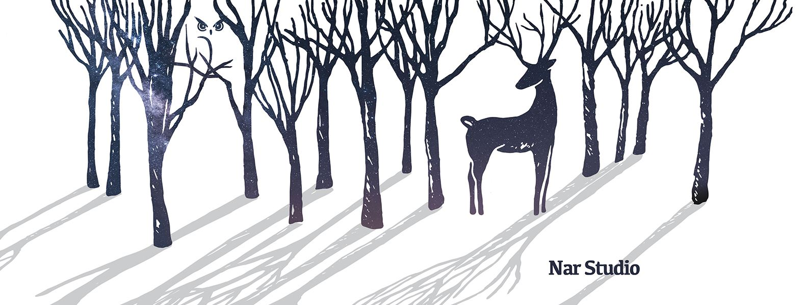
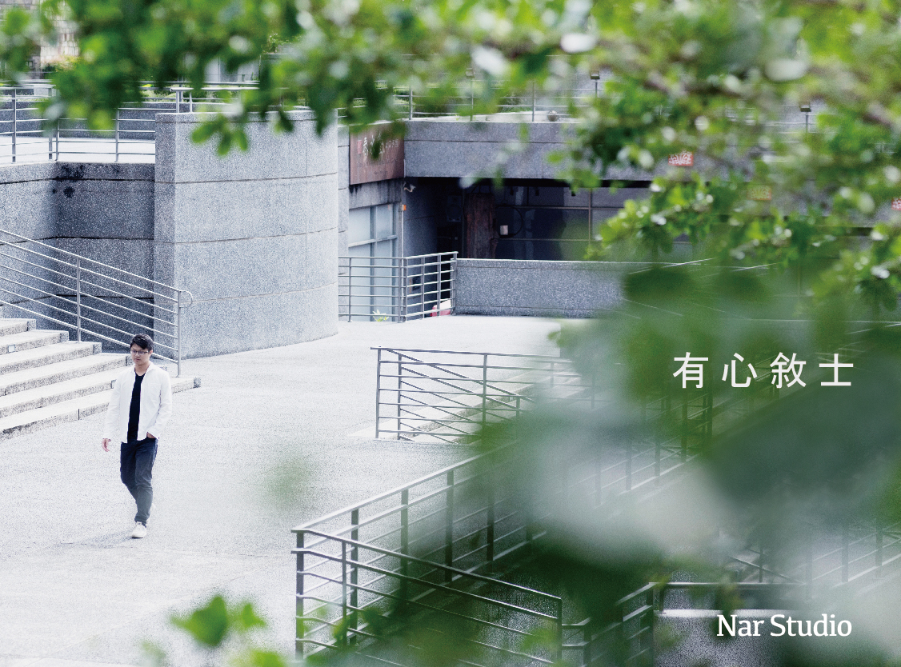

::: {.wrap .hero}
[城市 × 心理 × 設計]{.eyebrow}

[人在城市裡， 如何過得好？]{.display}

::: {.hero-row}
我是臨床心理師，現在在 University of Glasgow 學城市分析。我用心理學觀察人，用數據理解城市，再把兩者設計成可以被體驗的東西。

[看我的方法 →](method.qmd){.underline-link}
:::
:::

::: {.hero-image}

:::

::: {.band-mist}
::: {.wrap .pad}
::: {.section-head}

[方法]{.eyebrow}
<h2 class="section-title">從觀察一個人，到理解一座城市</h2>

[完整方法學 →](method.qmd){.underline-link}
:::

::: {.steps}
::: {.step}
[01]{.step-num}
[觀察]{.step-title}

像心理師一樣看：人在哪裡停留、怎麼移動、表情與節奏。
:::

::: {.step}
[02]{.step-num}
[理解]{.step-title}

用心理學概念解讀：地方依附、注意力恢復、希望感。
:::

::: {.step}
[03]{.step-num}
[分析]{.step-title}

用城市數據檢驗：地圖、交通、政策評估。
:::

::: {.step}
[04]{.step-num}
[設計]{.step-title}

轉化成可以被走進去的體驗：工作坊、體驗設計、工具。
:::
:::
:::
:::

::: {.wrap .pad}
::: {.section-head}

[城市筆記]{.eyebrow}
<h2 class="section-title">在 Glasgow 重新長出歸屬感</h2>

[全部文章 →](observations/index.qmd){.underline-link}
:::

::: {#latest}
:::
:::

::: {.wrap}
::: {.about-strip}
::: {.about-photo}

:::

::: {.about-text}
[關於]{.eyebrow}

<h2>臨床心理師， 正在學習讀懂城市</h2>

心理學碩士，研究希望感。現在在 Glasgow 攻讀 Urban Analytics 碩士，同時經營有心敘士工作室。

[更多關於我 →](about.qmd){.underline-link}
:::
:::
:::

::: {.band-navy}
::: {.wrap .pad .studio}
::: {.studio-logo}

:::

::: {.studio-text}
[合作 · 有心敘士工作室]{.eyebrow}

<h2>看見心中的真，擁抱心的感動</h2>

以心理學為本的體驗設計工作室。提供體驗設計與工作坊，未來加入城市分析服務。

::: {.btn-row}
[委託合作](collaborate.qmd){.btn-sun} [已完成的案例](works.qmd){.btn-ghost}
:::
:::
:::
:::


